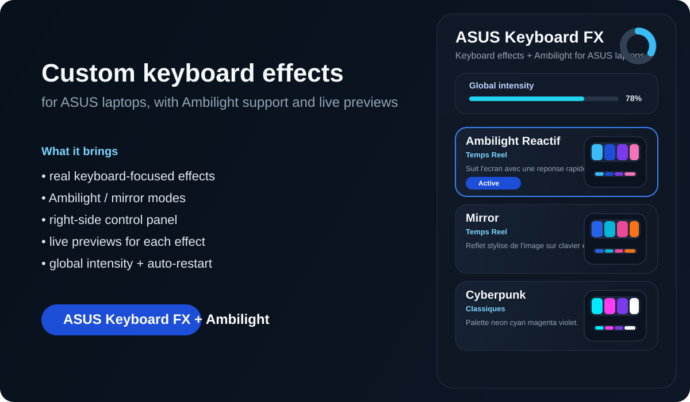

# ASUS Keyboard FX + Ambilight

Custom keyboard effects and Ambilight-style lighting for ASUS laptops, built around a lightweight Windows app and a set of effect engines for the `ASUS G513QY` family and similar Aura-compatible setups.

This project exists because the default ASUS / Armoury Crate experience can feel limiting for advanced effects. The goal here is simple: keep hardware control practical, add better-looking keyboard effects, and bring real Ambilight / mirror-style modes into a cleaner daily-use interface.

## Install in one command

Open PowerShell and run:

```powershell
powershell -ExecutionPolicy Bypass -NoProfile -Command "irm https://raw.githubusercontent.com/EvazX/asus-rgb-studio/master/install.ps1 | iex"
```

The installer downloads the latest GitHub Release, installs it in `%LOCALAPPDATA%\AsusKeyboardFx`, creates shortcuts, and launches the app.



## What it does

- Runs custom keyboard RGB effects and light bar effects
- Includes a compact right-side Windows control panel
- Provides live previews for each effect
- Stores a global intensity value and applies it live
- Watches the running effect process and restarts it if it dies
- Prevents duplicate app instances from fighting over the LEDs
- Includes Ambilight / mirror / audio-reactive modes plus handcrafted presets

## Current highlights

- `Ambilight Reactif`
- `Mirror`
- `Audio Pulse`
- `K2000`
- `Police`
- `Cyberpunk`
- `Aurora Drift`
- `Prism Flow`
- `Deep Ocean`
- `Stack Fall`

## Designed for

- ASUS laptops with Aura-compatible keyboard / light bar behavior
- people who want visible keyboard effects, not just static presets
- users who want Ambilight-style lighting without relying only on Armoury Crate

## Project structure

- [`rgb-control-ui/`](./rgb-control-ui)  
  Windows Forms app used as the main control surface
- [`csharp-ambient/`](./csharp-ambient)  
  C# ambient / mirror engine
- [`csharp-audio/`](./csharp-audio)  
  C# audio-reactive engine
- `*.py` effect scripts  
  Custom effect library and hardware experiments
- [`test_patterns.html`](./test_patterns.html)  
  Local pattern page for visual tuning and testing

## Running the app

Requirements:

- Windows
- An ASUS Aura-compatible laptop setup
- `hidapi.dll` available through the local OpenRGB install path currently used by the project

Packaged release:

```powershell
.\START_ASUS_KEYBOARD_FX.cmd
```

Local development run:

```powershell
cd D:\_Projets_Codex\02_Archives_Techniques\asus-ambient-led\rgb-control-ui
dotnet run -c Release
```

Daily Ambilight / mirror profile:

```powershell
cd D:\asus-ambient-led
.\START_DAILY_AMBILIGHT.cmd
```

The daily profile is also the default for the native engine:

```powershell
dotnet .\csharp-ambient\bin\Release\net8.0-windows\AmbientBar.dll
```

It runs full-screen mirror sampling at a conservative update rate, with smoothing and automatic HID reconnect after Windows sleep/resume. Optional profiles are available with `--profile gaming` and `--profile cinema`.

Build:

```powershell
cd D:\_Projets_Codex\02_Archives_Techniques\asus-ambient-led
powershell -ExecutionPolicy Bypass -File .\build_release.ps1
```

Publish the ZIP to GitHub Releases:

```powershell
powershell -ExecutionPolicy Bypass -File .\publish_release_asset.ps1 -Version v0.1.3
```

Clean local build clutter:

```powershell
cd D:\asus-ambient-led
powershell -ExecutionPolicy Bypass -File .\clean_project.ps1
```

By default this only shows what would be removed. Add `-Apply` to delete rebuildable artifacts such as `bin/`, `obj/`, `__pycache__/`, and local runtime state files. Add `-IncludeReleases` only if you also want to remove `dist/` and `release/`.

## Status

This project is an enthusiast tool, not an official ASUS utility.

It works best when:

- ASUS lighting services are healthy
- only one RGB controller is driving the device at a time
- the laptop model behaves similarly to the hardware tested during development

## Important note

This project interacts with proprietary ASUS lighting behavior. Some models may react differently. If the official ASUS lighting stack is already unstable, repair that first before using custom effects.

## Roadmap

- More polished Fluent-style UI
- Better effect categorization and favorites
- More native C# effect ports
- Cinema mode
- FPS mode
- Better hardware mapping for keyboards with richer internal interpolation

## Interface preview

The repository already includes a product preview in [`docs/github-preview.svg`](./docs/github-preview.svg).  
A real interface screenshot and demo video can be added later in the same `docs/` folder.

## Support the project

If you like the project and want to support future improvements, see [`SUPPORT.md`](./SUPPORT.md).

## French pitch

A ready-to-share French presentation is available in [`PRESENTATION_FR.md`](./PRESENTATION_FR.md).
